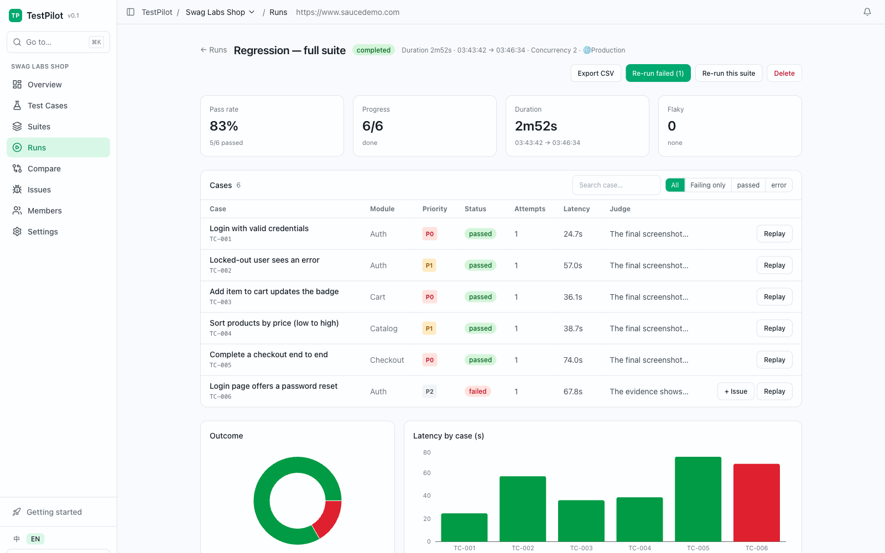
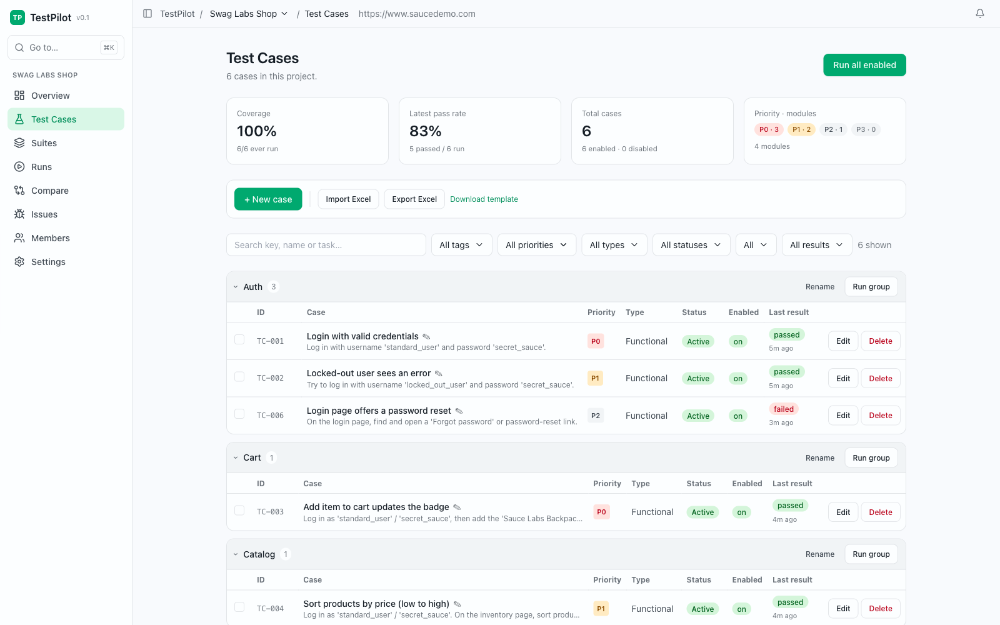
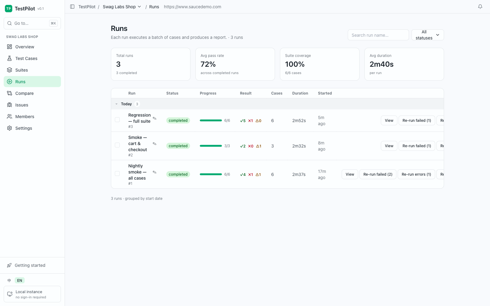
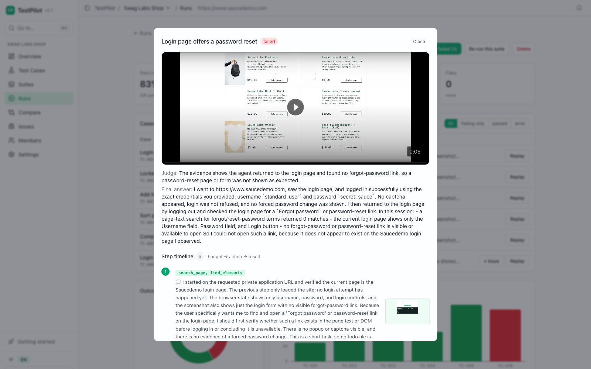
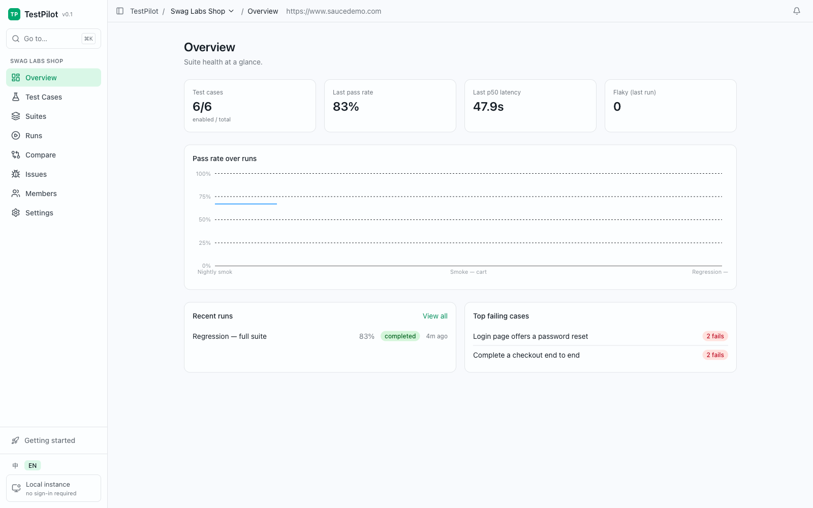
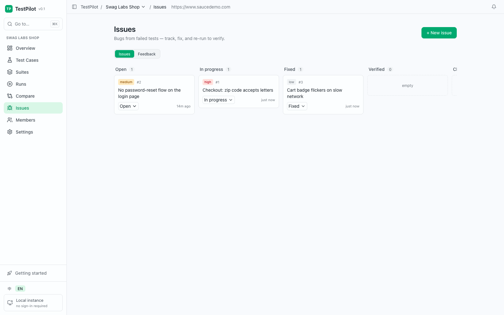
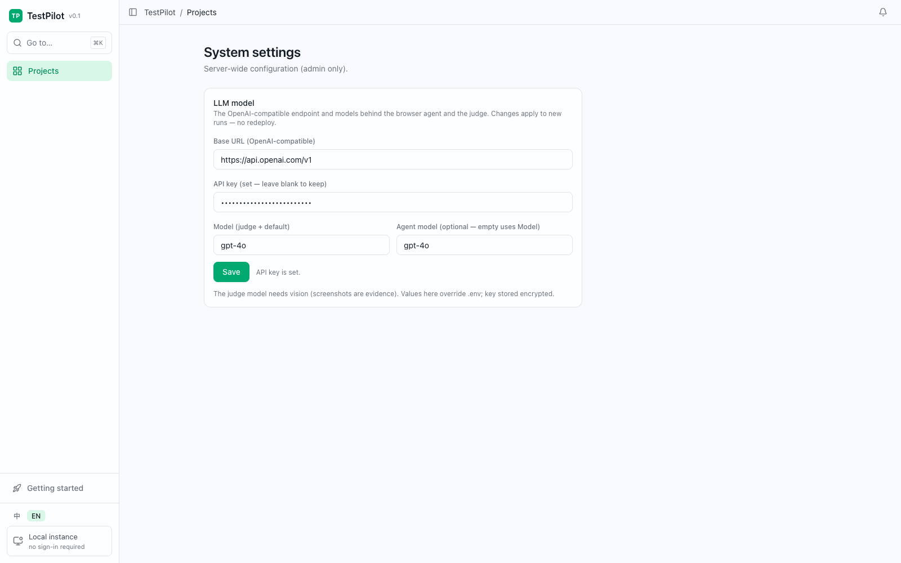

<div align="center">

# TestPilot

**Agent 化的端到端测试平台** —— 用自然语言写测试用例，浏览器 Agent 在真实 Chrome 里执行，
LLM 裁判根据证据（录像、截图、操作轨迹）判定通过/失败。

[](https://github.com/H0nGzA1/testpilot/actions/workflows/ci.yml)
[](LICENSE)
[](pyproject.toml)
[](web/package.json)
[](CONTRIBUTING.md)

[English](./README.md) · 简体中文



</div>

```
自然语言用例 ──▶ 浏览器 Agent（browser-use → Playwright/CDP → Chromium）
                        │  录像 + 截图 + 操作历史
                        ▼
                   LLM 裁判 ──▶ 通过 / 失败 + 理由 ──▶ 聚合运行报告
```

## 为什么

传统 E2E 脚本（Playwright/Cypress）一改选择器就碎。TestPilot 的用例是*提示词*而不是脚本：

> "以审核员角色登录，打开待审批列表，通过第一条记录，并验证其状态变为已通过。"

点击路径由 Agent 自己找；裁判读证据下结论，证据不足时**默认判失败**——不给虚假的绿色。

## 界面截图

| 测试用例 —— 大白话描述，按模块分组 | 运行列表 —— SSE 实时进度 |
| :---: | :---: |
|  |  |

| **回放 —— 录像、裁判结论、Agent 逐步轨迹** | **项目总览 —— 通过率趋势与高频失败用例** |
| :---: | :---: |
|  |  |

| **问题看板 —— 失败用例一键转 issue 跟踪** | **运行时 LLM 设置 —— 换模型无需重新部署** |
| :---: | :---: |
|  |  |

## 功能

- **自然语言用例** —— 按项目组织、可复用、可打标签，支持 Excel (.xlsx) 导入导出
- **真实浏览器执行** —— 每个用例一个 Chromium（基于 [browser-use](https://github.com/browser-use/browser-use)），产出 mp4 录像、逐步截图、可回放的操作历史 JSON
- **LLM 裁判** —— 判定通过/失败并给出书面理由；刻意保守（证据单薄 ⇒ 失败）；基础设施错误会重试并标记"侥幸通过"（flaky），裁判判失败不重试
- **模型随便换** —— 任何 OpenAI 兼容端点都行；Base URL / 密钥 / 模型可在**系统设置**里运行时修改（无需重新部署），Agent 可单独指定模型（如本地视觉模型）
- **运行与报告** —— 并发执行 + 全局浏览器额度、SSE 实时进度、逐用例回放、只重跑失败/只重跑报错用例、运行对比
- **环境与账号** —— 项目内多环境（测试/预发/…）、多登录账号 + 角色；登录态捕获复用（cookies + localStorage + **sessionStorage**，走 CDP），用例直接以已登录状态开跑，不把步数烧在登录页上
- **问题跟踪** —— 内置看板；可选 **GitLab issue 双向同步**（默认关闭，`ENABLE_GITLAB=true` 开启）
- **飞书机器人** —— 可选（默认关闭，`ENABLE_FEISHU=true` 开启）：群聊绑定项目、聊天触发运行、结果卡片、群反馈自动建 issue、多维表格同步
- **多用户** —— 可选登录、共享工作区或项目级 owner/editor/viewer 权限、邮件邀请
- **双语界面** —— English / 简体中文

## 快速开始（本地开发）

前置：Python ≥ 3.11、Node 20 + pnpm、一个 OpenAI 兼容的 LLM 端点（OpenAI 本身，或任何同协议的网关/本地 VLM）。

```bash
# 后端
uv venv && source .venv/bin/activate
uv pip install -e ".[dev]"
playwright install chromium
cp .env.example .env               # 填 GATEWAY_BASE_URL / GATEWAY_API_KEY / GATEWAY_MODEL

python -m pytest tests/            # 自检，无需浏览器/LLM
python scripts/smoke.py            # 端到端冒烟：真实浏览器跑 example.com -> 出结论
uvicorn app.main:app --port 8099   # API

# 前端（把 /api 和 /artifacts 代理到 :8099）
cd web && pnpm install && pnpm dev # http://localhost:5180
```

## Docker 部署

一个镜像跑全栈（API + SPA + Celery worker/beat + 飞书 worker），外加内置 Postgres 与 Redis：

```bash
cp .env.example .env                                        # 至少设置 TESTPILOT_SECRET_KEY
docker build -f Dockerfile.base -t testpilot-base:latest .  # 依赖 + Chromium（一次性）
docker compose build
docker compose up -d
open http://localhost:8000
```

完整手册见 **[docs/deployment.md](docs/deployment.md)**（镜像分层、浏览器额度、端口、迁移），全部配置项见 **[docs/configuration.md](docs/configuration.md)**。

## 目录结构

```
app/
  config.py     配置（.env）
  models.py     Project · TestCase · Run · RunResult · Issue · User · …
  engine.py     运行循环：并发 drain + 失败隔离 + 聚合
  executor.py   每用例一个浏览器、录制、登录态捕获/恢复（CDP）
  judge.py      LLM 裁判（证据单薄默认判失败）
  llm.py        OpenAI 兼容客户端（Agent + 裁判）
  api.py        REST + SSE
  storage.py    产物存储：S3 兼容或本地磁盘
  gitlab_*.py   issue 双向同步（Celery worker + beat）
  feishu*.py    飞书机器人：指令、卡片、反馈建单、多维表格
web/            React + Vite + Tailwind 前端
alembic/        数据库迁移（容器入口自动 upgrade head）
docs/           部署/配置手册与设计文档
tests/          pytest 套件（纯逻辑，无需浏览器）
```

## 裁判如何工作

每个用例产出：URL 轨迹、带截图的逐步操作历史、mp4 录像。裁判拿到用例的预期结果与这些证据，必须给出通过/失败**及理由**，语言由 `REPORT_LANGUAGE` 控制。超时/连接错误算*基础设施错误*（按 `CASE_RETRIES` 重试，重试才通过的用例标记 flaky）；裁判判的"失败"永不重试。

## 贡献

欢迎 PR —— 见 [CONTRIBUTING.md](CONTRIBUTING.md)。提交前跑 `ruff check .` 和 `python -m pytest tests/`。

## 许可证

[MIT](LICENSE)
